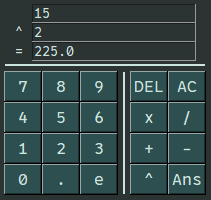
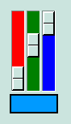

# 1. Große Layouts
Baue folgendes Layout so genau wie möglich nach:\


Natürlich muss es nicht auf einzelne Pixel genau sein, es geht um den Aufbau.

Das verwendete Theme ist `sg.FourColors.SlateBlue`.


# 2. Themes (Optional)
Erstelle ein gutaussehendes Theme und teste es mit `sg.Examples.preview_all_elements()`.

Gute Themata integriere ich mit deiner Erlaubnis gerne ins SwiftGUI-package.

Für ein vollständiges Thema, denk daran, dass deaktivierte/readonly Elemente standardmäßig anders aussehen.
Um auch das zu berücksichtigen, teste es mit Folgendem:
```py
sg.Examples.preview_all_elements(flip_disabled=True, flip_readonly=True)
```


# 3. Popups
... folgt


# 4. Combined Elements
In dieser Übung erstellst du ein combined Element, das es dem Nutzer ermöglicht, eine Farbe zu erzeugen:\



Im Folgenden nenne ich das neue combined Element `Farbwahl` mit der beispielhaften Instanz `farbwahlElement`.

Die Farbe wird über 3 `sg.Slider` eingestellt und in einem Element deiner Wahl angezeigt.

Verwende folgende Elemente als Grundlage, wenn du möchtest:
```py
sg.Slider(
    number_min=255,
    number_max=0,
    orient="vertical",
    showvalue=False,
    troughcolor="blue",
)
```
```py
sg.Button(  # (Mögliches Element zum Anzeigen der Farbe)
    disabled=True,
    relief="solid",
    expand=True,
)
```
Tipp: `sg.rgb` lässt sich nutzen, um RGB-Werte in eine "Farbe" umzuwandeln.
Die Werte werden als `int` im Bereich von 0 bis 255 übergeben.

Folge diesem Ablauf:
1. Erstelle das reine Layout in einem neuen combined element und teste es.
2. Sorge dafür, dass das farbige Element seine Farbe automatisch anpasst.
3. Das Farbwahl-Element soll bei der Erstellung optional einen Standardwert übergeben bekommen, in der Form "(rot, grün, blau)" (`tuple[int, int, int]`). Diese Farbe ist zu Beginn ausgewählt.
4. Das Farbwahl-Element soll sein Event auslösen, wenn sich die Farbe ändert. Denk dran, dazu auch die Parameter `key`, `key_function` und `default_event` bereitzustellen.
5. Mit `farbwahlElement.value` soll sich der Wert des Farbwahl-Elements zurückgeben lassen. Dieser Wert hat den Typen `tuple[int, int, int]` und beinhaltet entsprechende Zahlen für rot, grün und blau.
6. Mit z.B. `farbwahlElement.value = (255, 0, 152)` soll sich eine andere Farbe "auswählen" lassen. Dabei sollen sich natürlich auch die Slider umstellen.
7. Mit `farbwahlElement.r` soll sich nur der Anteil "rot" auslesen, bzw. überschreiben lassen. Genauso für `farbwahlElement.g` und `farbwahlElement.b`.

# X. Praxisbeispiel
Folgende Situation:\
An einen Raspberry Pi mit Touchscreen ist ein QR-Code Scanner angeschlossen.

Der Scanner funktioniert wie eine Tastatur: Nach dem Scannen wird der gescannte Text "geschrieben" und enter gedrückt.

Da weder Maus noch Tastatur angeschlossen sind, muss man bei der Eingabe kreativ sein.

Erstelle das Element `ScanInputButton`.

# XX. Verschiedenes
Folgendes Layout enthält zwei `sg.Notebook`.

Sorge dafür, dass wenn der Nutzer den Tab eines Notebooks wechselt, auch der Tab des Anderen wechselt.
Beide Notebooks haben also "immer" den gleichen Tab geöffnet.

Die Layouts beider notebooks sind identisch, könnten aber erweitert werden.
Stelle also sicher, dass deine Lösung auch mit 3, oder mehr Tabs funktioniert.

Bonuspunkte, wenn du es mit sinnvollen key-functions löst.

```py
import SwiftGUI as sg

sg.Themes.FourColors.Jungle()

layout = [
    [
        notebook1 := sg.Notebook(
            sg.TabFrame([
                [sg.T("Tab 1")]
            ], fake_key="Tab1"),
            sg.TabFrame([
                [sg.T("Tab 2")]
            ], fake_key="Tab2"),
        )
    ], [
        sg.Spacer(height=5),
    ], [
        notebook2 := sg.Notebook(
            sg.TabFrame([
                [sg.T("Tab 1")]
            ], fake_key="Tab1"),
            sg.TabFrame([
                [sg.T("Tab 2")]
            ], fake_key="Tab2"),
        )
    ]
]

w = sg.Window(layout, padx=30, pady=30)

for e,v in w:
    print(e, v)
```


