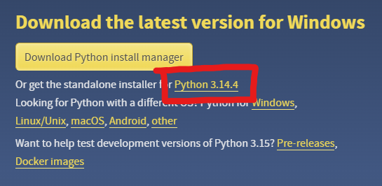
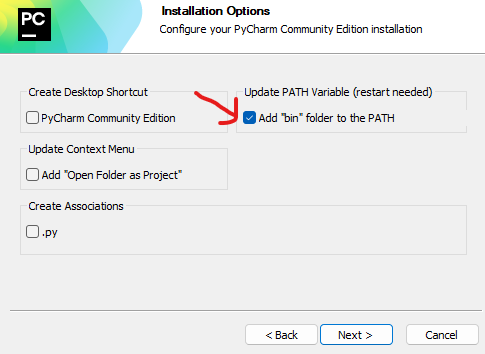
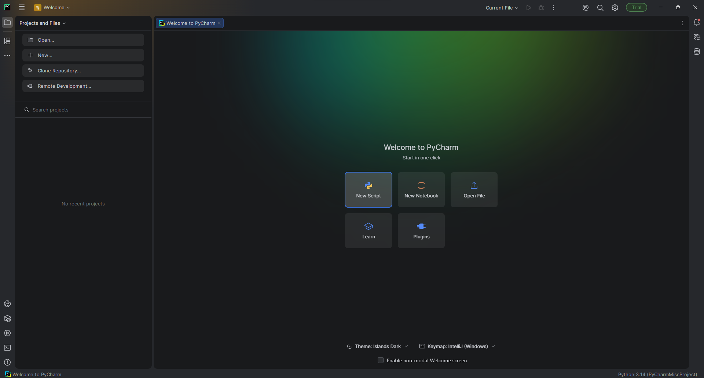

## Folge dieser Anleitung präzise und Schritt für Schritt, ansonsten wird definitiv etwas falsch installiert werden.

## 1. Python installieren

Diese Anleitung ist für Python Version 3.14.0, aber sollte für andere Versionen genauso funktionieren.

1. Lade dir den neusten Python-Installer herunter: https://www.python.org/downloads/ \
Klick aber NICHT auf den sehr auffälligen gelben Knopf, sondern auf "Or get the standalone installer for Python 3.14...":\


2. Hast du es bereits ausgeführt und installiert, weil du dachtest, du müsstest dieser Anleitung nicht genau folgen? Dann deinstallier Python wieder und folge der Anleitung ab jetzt Schritt für Schritt.\
Öffne den Installer. Auf der ersten Seite gibt es die Option `Add python.exe to PATH` (Siehe Bild).\
Die musst du auswählen. Danach auf `Customize installation` clicken.
    

3. Lass auf dieser Seite alles so wie es ist und klick auf next.
4. Auf dieser Seite musst du zusätzlich `Install Python 3.14 for all users` auswählen (Siehe Bild). Danach auf "Install" klicken.

5. Der Rest ist selbsterklärend.

## 2. Python-Konsole öffnen
Mach das einmal um zu testen, ob du Python korrekt installiert hast.
Lässt sich die Konsole nicht öffnen, hast du Python falsch installiert.

Ich nehme mal an, dass die meisten von euch Windows nutzen. Wer Linux nutzt, ist vermutlich technisch aversiert genug, Python auch ohne diese Anleitung korrekt zu installieren.\
Von Mac hab ich keine Ahnung.

1. Mache einen Rechtsklick auf das Windows-Logo und wähle `Ausführen` (englisch `Run`) aus.\
Alternativ kannst du auch `Windowstaste + R` drücken.
2. Gib `cmd` ein und drück `Enter` oder `ok`. Jetzt sollte sich die Eingabeaufforderung (cmd) öffnen.
3. Gib in der cmd `python` ein und drück enter. Wenn da sowas steht wie `Der Befehl ... konnte nicht gefunden werden`, 
probier mal `python3`. Wenn da der gleiche Fehler steht, oder sich der Windows-Store öffnet, ist Python nicht korrekt installiert.\
Eigentlich sollte da sowas stehen:
    ```batch
    Python 3.13.0 (tags/v3.13.0:60403a5, Oct  7 2024, 09:38:07) [MSC v.1941 64 bit (AMD64)] on win32
    Type "help", "copyright", "credits" or "license" for more information. 
    ```
4. Du bist jetzt in der Python Konsole, hat also alles geklappt. Du kannst ja mal etwas damit rumprobieren, z.B. indem du `5 + 7 * 2` eingibst.


## 3. Pycharm installieren

Pycharm ist eine IDE für Python, also ein Programm, mit dem man Python programmiert.
Es enthält viele Funktionen, die das Programmieren extrem erleichtern.
Es zeigt dir beispielsweise mögliche Probleme im Code und hat eine Auto-Vervollständigung.

VSCode ist auch eine sehr beliebte IDE für Python.
Rein theoretisch hat VSCode auch die gleiche Features wie PyCharm, allerdings sind die in der Praxis lange nicht so gut.
Außerdem ist die Installation komplizierter, da man viele Features manuell über Addons installieren muss.\
Der einzige Vorteil von VSCode ist, dass es deutlich schneller ist.
Wenn dein PC also mit PyCharm nicht klarkommen sollte, dann nimm VSCode.

PyCharm hat eine kostenlose Version.
Da steht zwar 30-Tage-Testversion, aber das bezieht sich nur auf die kostenpflichtigen Features.
Du kannst das Programm danach weiterhin nutzen.

1. Öffne diese Seite: https://www.jetbrains.com/de-de/pycharm/download/?section=windows 
2. Klick recht weit oben auf der Seite auf "Herunterladen".
3. Öffne den Installer. Lass alles auf auf default, bis du die Option `Add "bin" folder to the PATH` (Siehe Bild) angekommen bist.
Diese Option musst du auswählen.\

4. Danach einfach weiter durchklicken, sollte selbsterklärend sein.

Bei mir sah es beim ersten Programmstart so aus, kann bei dir aber abweichen:




